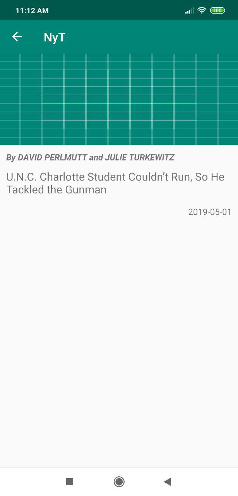

# NT Times Example Android MVVM

This is a simple Android Application to consume the NY Times Most Popular Articles API and show a list of articles.

## Installation
Clone this repository and import into **Android Studio**
 ```bash
git@github.com:fundroid/NyT-mvvm.git
```
or 
```bash
https://github.com/fundroid/NyT-mvvm.git
```

## Developed
1. Model–view–viewmodel (MVVM) architectural pattern
2. Offline supported
3. Retrofit server call 
4. UI & functions tested using JUnit & espress

## Screens

<b>Main article list Screen</b>


<b>Details View Screen</b>


## Generating signed APK
From Android Studio:
1. ***Build*** menu
2. ***Generate Signed APK...***
3. Fill in the keystore information *(you only need to do this once manually and then let Android Studio remember it)*

## Maintainers
This project is mantained by:
* [Sagar V](https://github.com/fundroid)
